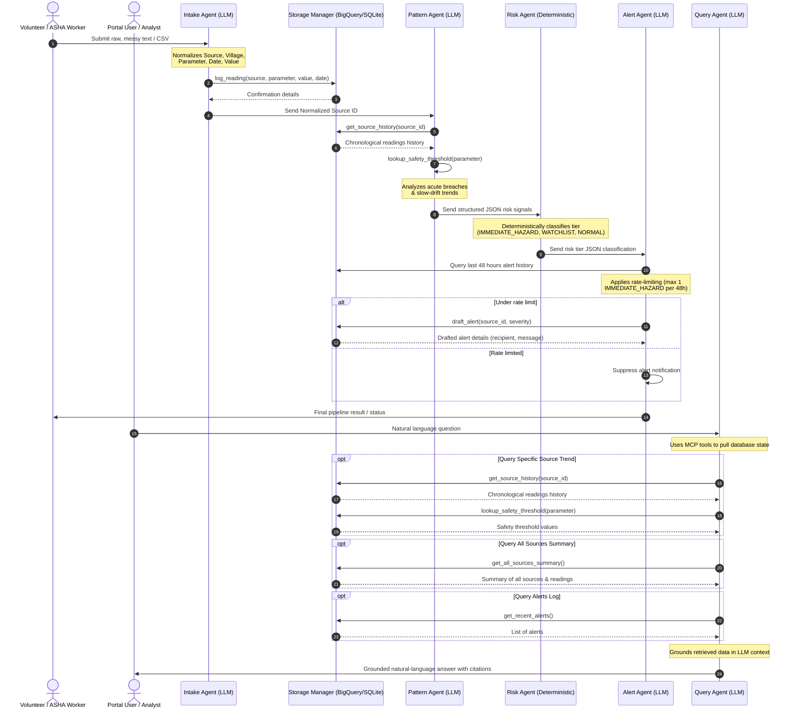

# HydroWatch: Multi-Agent Water Safety Pipeline 💧


**HydroWatch** is an advanced multi-agent system designed for public health water monitoring in rural and peri-urban areas. Built using the **Google ADK** (Agent Development Kit), the pipeline automates the collection, normalization, hazard detection, and notification drafting of messy water quality readings (such as Fluoride, Arsenic, Turbidity, E.coli counts, and pH) collected by community volunteers and ASHA workers.

By detecting both acute hazard breaches and slow, creeping contamination trends (e.g., fluoride levels rising over months) early on, HydroWatch ensures public health warnings are issued *before* community exposure occurs.

---

## 🌟 Kaggle Hackathon Highlights

This project extensively implements key concepts for next-generation Agentic AI:

*   **Multi-Agent System (ADK)**: We leverage a coordinated 5-agent architecture (Intake, Pattern, Risk, Alert, and Query). Agents share contextual sessions and state via `InMemorySessionService`, passing normalized JSON signals between one another.
*   **Model Context Protocol (MCP) Server**: The project features a fully operational standard I/O MCP Server (`mcp_server/server.py`) that safely exposes local BigQuery/SQLite database capabilities (like `log_reading` or `draft_alert`) to any MCP-compliant client.
*   **Agent Skills**: The `query_agent` inherits grounded, deterministic logic from the `.agents/skills/water-safety-schema` skill definition, ensuring all WHO/BIS thresholds are 100% accurate. We also feature an interactive **Agents CLI** (`cli.py`) for terminal-based interaction.
*   **Security Features**: *(In Progress)* Implementing Role-Based Access Control (RBAC), basic authentication, and rigorous Prompt Injection defenses to protect public health data.
*   **Deployability**: Fully containerized using `Dockerfile` and automated Google Cloud Run deployment scripts (`deploy.sh`), enabling instant, serverless scaling.

---

## 🏗️ Architecture & Multi-Agent Data Flow

The system consists of **5 distinct ADK Agents**: 4 sequential pipeline agents coordinating via a shared session context, and a conversational Query Agent.



1. **Intake Agent (LLM)**: Accepts unstructured readings, normalizes them to a strict schema, validates parameter ranges (pH in `[0,14]`, non-negative values), and calls `log_reading`.
2. **Pattern Agent (LLM)**: Interrogates the database history for the target source, looks up WHO/BIS safety limits, and analyzes readings chronologically for acute breaches and slow-drifts.
3. **Risk Classification Agent (Deterministic)**: Subclass of `BaseAgent` performing auditable, code-defined logic mapping signals to `IMMEDIATE_HAZARD`, `WATCHLIST`, or `NORMAL`.
4. **Alert Agent (LLM)**: Drafts context-aware alerts, enforcing a strict rate limit of **max 1 URGENT alert per source per 48 hours** to avoid alert fatigue.
5. **Query Agent (LLM)**: Conversational assistant providing natural-language access to database values through "Ask HydroWatch", grounded entirely by the `water-safety-schema` skill.

---

## 💾 Dual-Mode Storage Layer

To support both enterprise production setups and offline edge local development, the storage layer (`schema/bq_schema.py`) implements a **dual-mode client with SQLite fallback**:
- **Production Mode**: Attempts Google Cloud authentication using Application Default Credentials (ADC) to connect to GCP BigQuery.
- **Offline / Fallback Mode**: If GCP credentials are not present, it gracefully falls back to a local SQLite database file `hydrowatch_local.db` and automatically initializes the tables.

---

## 🚀 Getting Started

### 1. Prerequisites
- Python 3.9 or 3.10
- GCP CLI (gcloud) configured (optional, for BigQuery mode)

### 2. Installation
Set up the virtual environment and install all dependencies:
```bash
python -m venv .venv
source .venv/bin/activate
pip install -r requirements.txt
```

### 3. Database Seeding
Seed the database with realistic synthetic data for 3 villages and 5 sources (including a fluoride drift scenario):
```bash
PYTHONPATH=. python seed.py
```

### 4. Exploring the Multi-Agent Interfaces
We provide multiple ways to interact with the ADK Agents:

**A. Run the Streamlit Dashboard (Recommended UI)**
Launch the local web server to access the premium monitoring dashboard and the "Ask HydroWatch" query agent:
```bash
streamlit run dashboard.py
```
Open your browser and navigate to **`http://localhost:8501`**. 

**B. Interactive Agents CLI**
Prefer the terminal? Run our conversational interface to chat directly with the Agents:
```bash
PYTHONPATH=. python cli.py
```

**C. Run the MCP Server Test**
Want to see the Model Context Protocol (MCP) in action? Our test script spins up the server via standard I/O and executes a tool handshake:
```bash
PYTHONPATH=. python test_mcp.py
```

### 5. Running Integration Tests
Verify the pipeline works correctly across normal readings, acute breaches, slow-drifts, and alert rate-limiting:
```bash
PYTHONPATH=. python test_pipeline.py
```

---

## ☁️ Deployment

### Containerization (Docker)
Build and run the Docker container locally:
```bash
docker build -t hydrowatch .
docker run -p 8501:8501 hydrowatch
```

### Google Cloud Run Deployment
You can deploy the app directly to Cloud Run using Google Cloud Build and the provided `deploy.sh` script:
```bash
chmod +x deploy.sh
./deploy.sh
```
This builds the container image remotely and deploys it as an unauthenticated HTTP service, automatically linking with Cloud Run's default environment and ports.

- **Security Features**: Rate-limited alerting (max 1 IMMEDIATE_HAZARD alert 
  per source per 48 hours), no personally identifiable information stored 
  beyond a reporter ID, and safety thresholds pinned to static, versioned 
  reference data that agents cannot alter at runtime.
